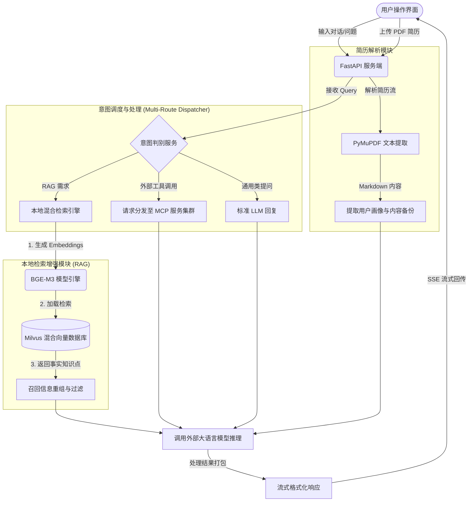

# 求职面试助手 

求职面试助手是一个基于大语言模型（LLM）的智能问答与简历分析系统。该项目整合了检索增强生成（RAG）、LangGraph 路由流控制以及本地化混合数据库架构，旨在辅助用户进行专业知识查询、简历初步评估与结构化面试模拟。

## 🎯 具备功能

1. **多路意图识别与混合调度**
   - 系统内置意图分发器（Dispatcher），可根据用户的自然语言输入，自动决策调用内部 RAG 知识库、外部 MCP (Model Context Protocol) 工具或提供基础问答。
2. **简历智能解析与评估**
   - 支持上传本地 PDF 简历。底层采用 PyMuPDF 进行高速纯文本提取，并结合在线大语言模型对内容进行匹配分析与评估。
3. **混合检索架构**
   - 通过本地部署 BGE-M3 模型，搭配 Milvus 向量数据库，实现基于稠密向量（Dense）与稀疏向量（Sparse）的双路混合检索能力，提升特定实体回调的准确性。
4. **交互式 Web 控制台**
   - 具备暗色主题的响应式前端界面。结合 Server-Sent Events (SSE)，实现流式对话输出；包含简历状态预览板与对话日志管理。

## ⚙️ 核心操作流程图

在使用环境中假设 MCP 服务端库已预设完毕的基础上，系统的核心请求交互流如下所示：

## 📂 项目模块层级架构

该项目按照常见的前后端分离架构及服务端多层逻辑规范进行模块化梳理。

- **`src/api/`**：暴露对外的 RESTful 接口与 WebSocket / SSE 路由支持接口。负责承接前端的数据传入规则及参数校验。
- **`src/core/`**：包含项目的核心中枢调度逻辑，含 `MultiRouteDispatcher` (意图多路并发决策模块)。
- **`src/database/`**：封装数据库基建，重点维护 Milvus RAG 的数据切分模式建立和双路混合映射规则设计。
- **`src/frontend/`**：存放由原生 HTML/CSS/JS 主导构建的单页交互系统（SPA）。包含 Markdown 解析渲染与样式定义。
- **`src/services/`**：核心具体业务逻辑实现处。内置了求职场景下复杂的 Prompt 工程调配，并下发数据给不同模型端口。
- **`src/utils/`**：通用工程工具箱集合。例如提供解析 PDF 至 Markdown 流程的 `pdf_parser.py` 实现脚本。

## 🚀 本地部署要求

1. 推荐在隔离的虚拟环境 (Conda / venv) 下部署依赖库，防止库版本不兼容问题（尤其是针对推理库与 transformers 版本）。
2. 在连接至业务逻辑之前，须正确配置 `Milvus` 服务实例及 `BGE-M3` 相关权重模型支持。
3. 部署后默认经由 `uvicorn` 工具拉起监听实例，命令参考：`python main.py`。启动后可从浏览器默认地址直接访问交互系统。
